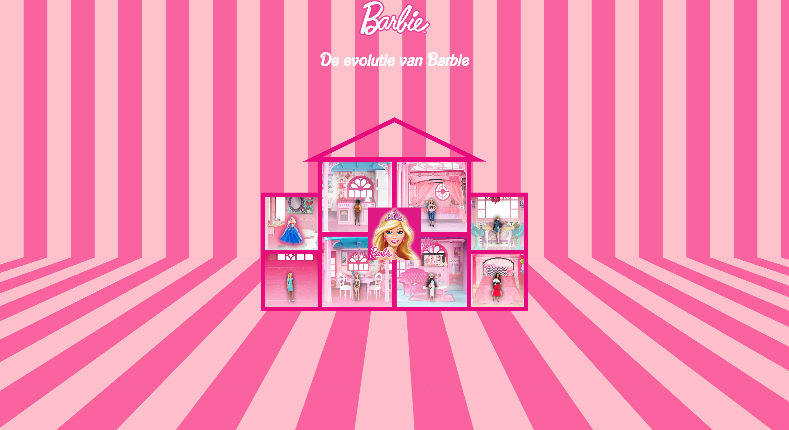
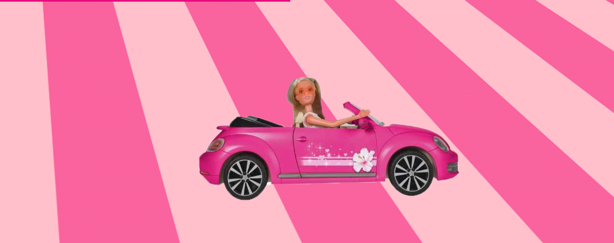
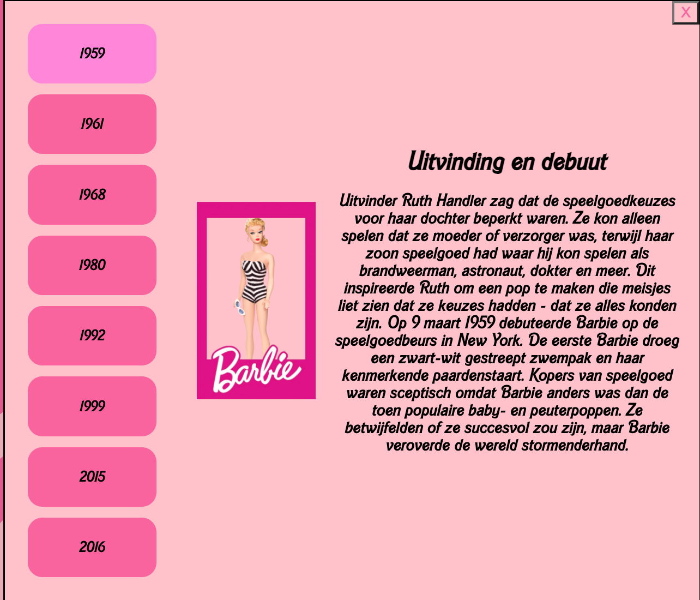
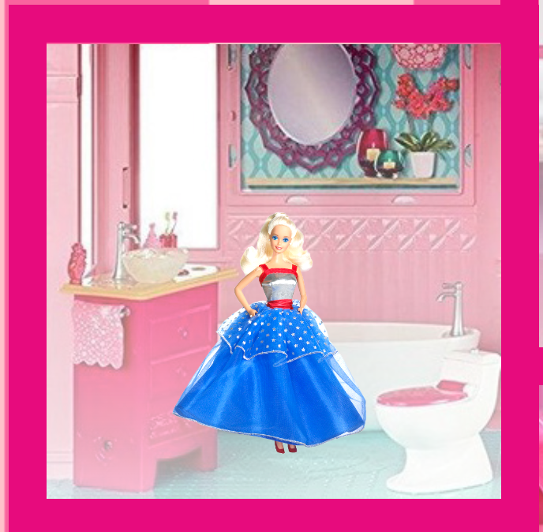
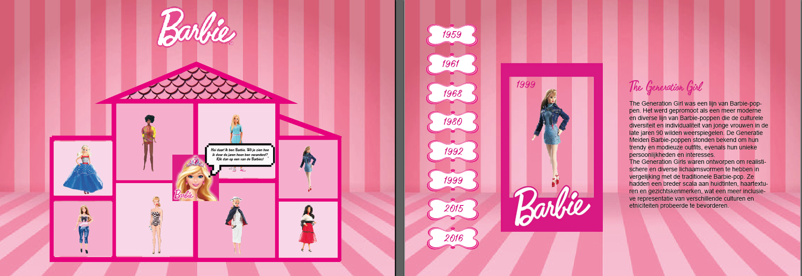
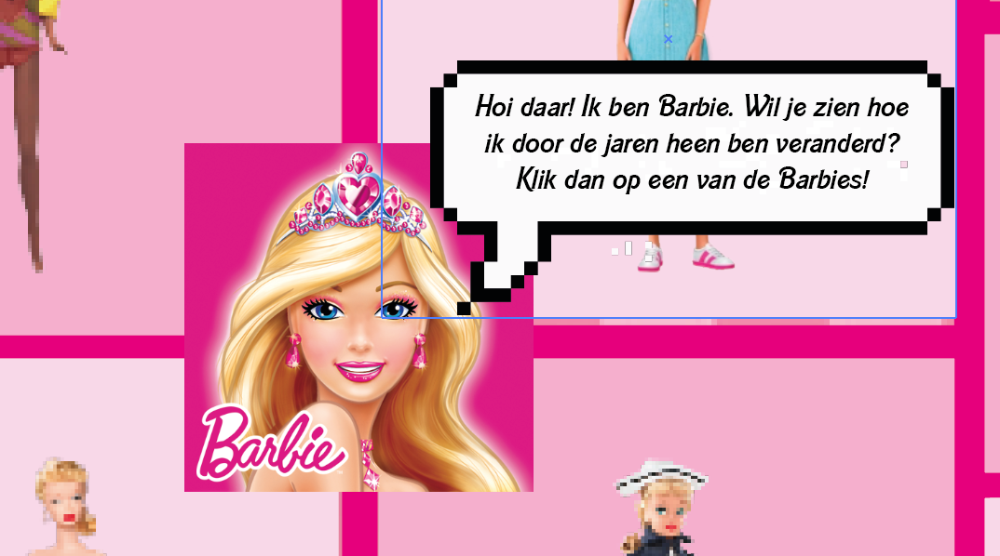

# Procesverslag
Markdown is een simpele manier om HTML te schrijven.  
Markdown cheat cheet: [Hulp bij het schrijven van Markdown](https://github.com/adam-p/markdown-here/wiki/Markdown-Cheatsheet).

Nb. De standaardstructuur en de spartaanse opmaak van de README.md zijn helemaal prima. Het gaat om de inhoud van je procesverslag. Besteedt de tijd voor pracht en praal aan je website.

Nb. Door *open* toe te voegen aan een *details* element kun je deze standaard open zetten. Fijn om dat steeds voor de relevante stuk(ken) te doen.

## Jij

### Ontwerper:
Isabelle Poel

#### Je startniveau:
Blauw 

# Je plan

  
De eerste versie/schets van je ontwerp & je persoonlijke uitdaging

  ### De eerste versie/schets:
  

  ### Je ambitie: 
  Aan deze technieken/punten wil ik werken:
  - Ik wil ten eerste html en css begrijpen omdat ik hier nog nooit mee heb gewerkt. Dus het begrijpen hiervan is een groot punt. 
  - Ik wil css gebruiken om de pagina vorm te geven en stijl toe te voegen, zoals het kiezen van kleuren en lettertypen die passen bij het thema van het Barbie-huis.
  - Ik wil leren hoe ik een grid kan maken in css, omdat ik dit nodig ga hebben om een barbie huis te kunnen realiseren. 

 

## Voortgang/Feedback 1

  
Mijn bevindingen + wijzigingen (minimaal 5)

  ### Bevinding 1:
  Feedback van Luna en Daniëlle op mijn eerste ideeën.

  

  #### oplossing:
 Aangezien Luna hier aangeeft dat er waarschijnlijk met Javascript gewerkt moet worden bij Idee 2, kies ik inderdaad liever voor optie 1. Ik wil eerst html en css begrijpen. 

  ### Bevinding 2:
  

  #### oplossing:
 Een goed idee van Daniëlle om mijn tijdlijn interactief te maken. Ik wil dus leren hoe ik een hover effect kan creëren. Ik ga bij elk jaartal een beschrijving toevoegen van hoe Barbie in dat jaar is geëvolueerd. Dit krijg je te zien als je op een jaartal klikt. 

  ### Bevinding 3:
   

   #### oplossing:
  Ik vind dit ook een goed idee voor mijn design. Barbie is een speels karakter. Door de jaartallen op willekeurige volgorde te zetten zet ik dat speelse effect door in mijn design. 

  ### Bevinding 4:
   

   #### oplossing:
  Ik ga de basis van het huis in illustrator maken. Voor de vakjes in het huis maak ik een grid. 

  ### Bevinding 5:
   

   #### oplossing:
  Na alle feedback te hebben gehoord is het duidelijk dat idee 1 het beste is voor iemand die net begint met coderen. Dit idee zal ik dan ook voortzetten.

## Voortgang/Feedback 2

  
Mijn bevindingen + wijzigingen (minimaal 5)

  Feedback van Nina
   
    
  
  
  ### Bevinding 1:
  Er zijn nog geen fonts aanwezig. 

  #### oplossing:
  Om het plaatje van mijn design compleet te maken hoort er een Barbie Font bij. Dit had ik nog niet ingevoegd. Ik ga met behulp van klasgenoten mijn font invoegen. 

  ### Bevinding 2:
  De tijdlijn is niet interactief. 

  #### oplossing:
  Ik ben nog niet zover dat mijn tijdlijn interactief is. Mijn plan is om de Barbie's als button te maken, zodat deze klikbaar zijn. Deze leiden naar een jaartal met beschrijving. Ook wil ik nog proberen om een Barbie in een auto te animeren. 

  ### Bevinding 3:
Er staat JS code in html

  #### oplossing:
  Om het liedje af te laten spelen als je over de Barbie in het midden hovert, heb ik Chat GPT een code uit laten schrijven. Deze is in html geschreven, terwijl het een code is voor JS. Ik heb dit opgelost door het aan jou te vragen. Nu staat de code goed in JS. 

  ### Bevinding 4:
  De costum properties zijn nog niet aangegeven. 

  #### oplossing:
  Ik zou moeten navragen wat dit inhoudt. Ik ga kijken of klasgenoten mij hierbij kunnen helpen. 

  
  
  ### Bevinding 5:
Teksten hebben niet voldoende contrast.

  #### oplossing:
  Ik heb voor de teksten een kleur gekozen die niet goed genoeg contrast biedt. Hiervoor ben ik nog even na gegaan welke kleuren ik beter kon gebruiken. Ik ben uiteindelijk een kleurpallette tegengekomen die voor Barbie wordt gebruikt. Hierdoor weet ik zeker dat deze kleuren goed bij elkaar passen. /

## Voortgang/Feedback 3

  
Mijn bevindingen + wijzigingen (minimaal 5)

  
  ### Bevinding 1:
  Je code ziet er prima netjes uit! wel nog een paar onnodige comment lines die je kan verwijderen, dus daar kan je naar kijken!

  #### oplossing:
  Ik heb de onnodige zinnen verwijderd. 

  ### Bevinding 2:
Verder is het maybe ook handig om in je code comments te plaatsen welke code bij wat hoort. Vind dat nu lastig terug te zien.

  #### oplossing:
Ik heb duidelijker aangegeven welke code bij wat hoort door comments te plaatsen. Hierdoor is mijn code hopelijk wat duidelijker. 

  ### Bevinding 3:
 Je hebt heel goed het thema van barbie aangehouden wat je heel duidelijk terug ziet. Je hebt een goed kleuren palet en je hebt een duidelijk contrast in je pagina. 

   #### oplossing:
   Fijn dat het contrast nu terug is te zien in mijn design. Tijdens feedback 2 was dit nog een punt van kritiek. 

   ### Bevinding 4:
 Ik zie wel dat je geen css custom properties hebt. Is wel iets waar je op wordt beoordeeld dus zou daar toch naar kijken!! 

   #### oplossing:
   Hier heb ik tijdens feedback 2 ook kritiek over gekregen. Ik ga proberen dit op eigen houtje nog te doen aangezien het nu vakantie is. Of dit ook gaat lukken weet ik niet. 

   ### Bevinding 5:
 Het ziet er verder als nette semantische code uit en alles heeft wel logische en beteknisvolle namen die je terug kan afleiden. Ik vind dat je voor iemand die pas een maand uberhaupt iets van code kent je het heel nice heb gedaan!

   #### oplossing:
   Er is niet zo zeer een oplossing voor deze feedback. Ik ga na het horen van deze feedback alle onnodige dingen verwijderen en comments toevoegen om alles duidelijker te maken. Hopelijk kom ik ook nog toe aan de custom properties. 
 

## Reflectie

  
Mijn eindresultaat & persoonlijke ontwikkeling

  ### Je uitkomst - karakteristiek screenshot(s):
  
  
  
  
   

  ### Dit ging goed/Heb ik geleerd: 
  - Ik heb geleerd hoe html en css in verband staan met elkaar. Ik heb geleerd hoe onderdelen aan elkaar gekoppeld zijn in code. Ik had nooit verwacht dat ik  uberhaupt iets zou kunnen neerzetten in code en dit is toch gelukt. Het design wat ik in mijn hoofd had, heb ik eerst uitgewerkt in illustrator zodat ik een duidelijk beeld had van wat ik wilde. Dit design heb ik zo goed als na kunnen maken met code en daar ben ik trots op. (zie afbeelding).

  ### Dit was lastig/Is niet gelukt:
  - Ik vond het lastig om de vormgeving los te laten. Het formulier dat opent als je op één van de Barbie's klikt vind ik bijvoorbeeld vrij amateuristicsh eruit zien. Ik heb dit moeten loslaten omdat ik nou eenmaal een beginner ben. 

   

   - Ik had heel graag nog een praatwolkje aan de Barbie in het midden willen toevoegen die een uitleg gaf over mijn design. (zie afbeelding hieronder). Hierdoor zou de kijker gelijk zien hoe er genavigeerd moet worden. Nu is dit misschien nog wat onduidelijk. Helaas ben ik hier noiet aan toegekomen en werd de code mij te lastig. 

  

  - Aan de costum properties heb ik geen tijd meer besteed. Hier baal ik van, maar ik heb niemand meer om hulp kunnen vragen. 

## Bronnenlijst

continu bijhouden terwijl je werkt

Nb. Wees specifiek ('css-tricks' als bron is bijv. niet specifiek genoeg).

1. https://www.artsy.net/artwork/mattel-first-barbie   
2. https://www.nrc.nl/nieuws/2009/03/09/barbie-moet-het-nu-opnemen-tegen-prinsessen-van-disney-11694735-a1198793 
3. https://indianexpress.com/photos/lifestyle-gallery/evolution-of-barbie-over-the-decades/ 
4. https://www.google.com/search?q=the+generation+girl+barbie&tbm=isch&ved=2ahUKEwiJmdrL7OX-AhXDi_0HHfl6AkgQ2-cCegQIABAA&oq=the+generation+gir&gs_lcp=CgNpbWcQARgAMgQIIxAnMgQIIxAnOggIABAIEB4QEzoFCAAQgAQ6CAgAEIAEELEDOggIABCxAxCDAToHCAAQigUQQzoLCAAQgAQQsQMQgwE6BAgAEB46BwgAEBMQgAQ6BggAEAgQHlDfA1jvPGDGRmgDcAB4AIABTIgBnAqSAQIyMpgBAKABAaoBC2d3cy13aXotaW1nwAEB&sclient=img&ei=4vtYZImgJcOX9u8P-fWJwAQ&bih=789&biw=1440&rlz=1C5CHFA_enNL896NL896#imgrc=YEDvkEbaRsiOwM&imgdii=t1gFk9XsTQErJM 
5. https://www.washingtonpost.com/news/business/wp/2016/07/12/how-president-barbie-has-changed-over-the-years/  
6. https://www.bol.com/nl/nl/p/barbie-fashionistas-curvy-blond-fashion-giftset/9200000059354176/  
7. https://lolsdolls.com/en/barbie-dreamhouse/  
8. https://www.spreadshirt.nl/shop/design/barbie+logo+neon+roze+sticker-D63778e50623cef1f109cc860?sellable=vrjzk8038nSxAXeQnoOq-1459-215   
9. https://aminoapps.com/c/barbiecute/page/item/myr/X00k_LjMUXIgLVDoBKBRmgPo3zZaQaM70w2  

